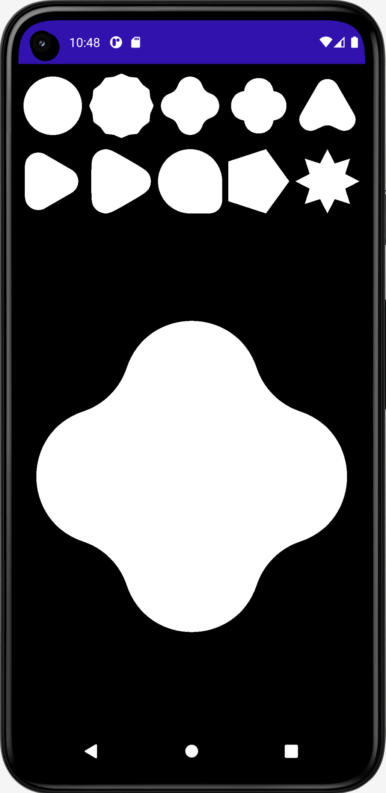
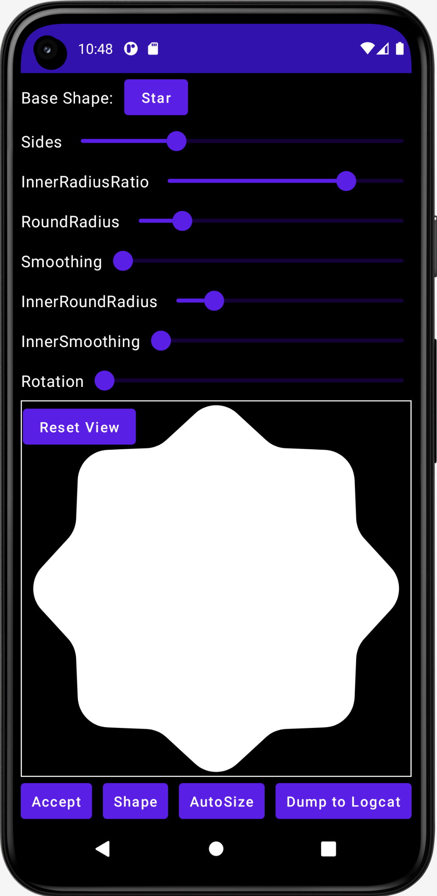
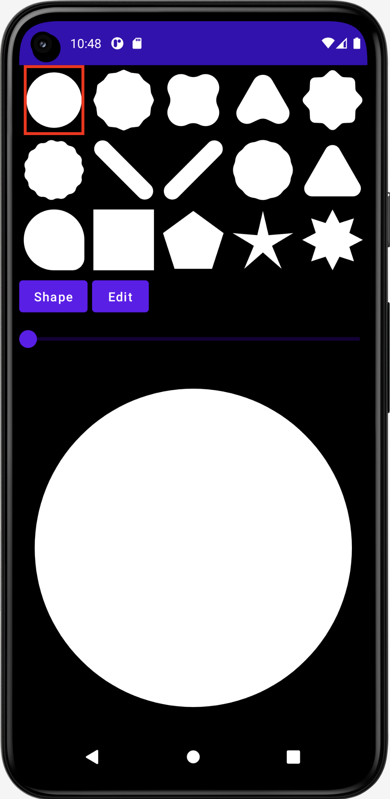
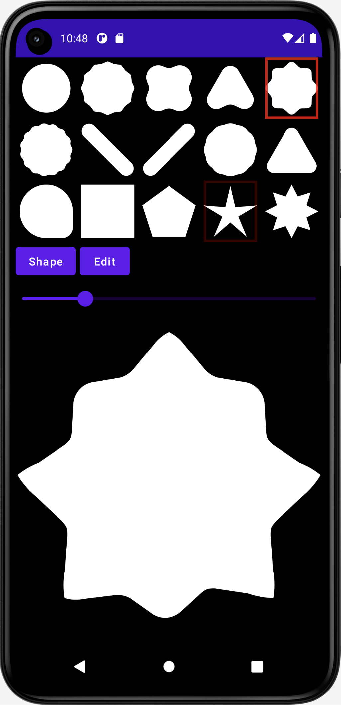

# ShapesDemo
Demo apps showing how to use the AndroidX :graphics:graphics-shapes: library

The View version, ShapesActivity, shows basic shape creation and morphing.

The Compose version of the app, ShapesAndMorphsActivity is more full-featured. It includes a
shape editor:

some other shape varieties:

and more options for viewing and scrubbing through a morph animation.

